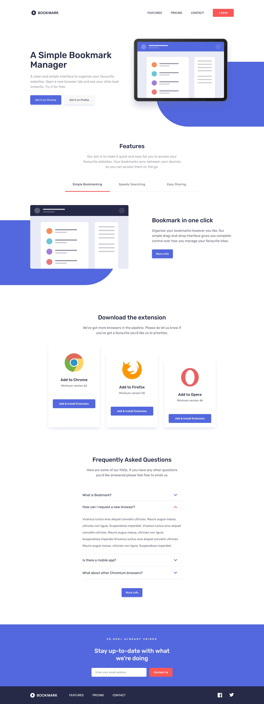
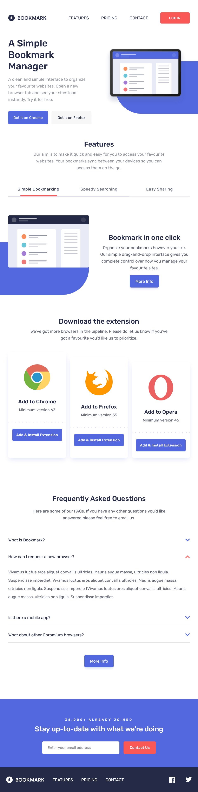
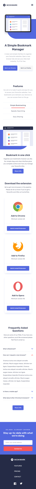

# Frontend Mentor - Bookmark landing page solution

This is a solution to the [Bookmark landing page challenge on Frontend Mentor](https://www.frontendmentor.io/challenges/bookmark-landing-page-5d0b588a9edda32581d29158). Frontend Mentor challenges help you improve your coding skills by building realistic projects.

## Table of contents

- [Overview](#overview)
  - [The challenge](#the-challenge)
  - [Screenshot](#screenshot)
  - [Links](#links)
- [My process](#my-process)
  - [Built with](#built-with)
  - [What I learned](#what-i-learned)
  - [Continued development](#continued-development)
  - [Useful resources](#useful-resources)
- [Author](#author)
- [Acknowledgments](#acknowledgments)

## Overview

### The challenge

Users should be able to:

- ✅ View the optimal layout for the site depending on their device's screen size
- ✅ See hover states for all interactive elements on the page
- ✅ Receive an error message when the newsletter form is submitted if:
  - ✅ The input field is empty
  - ✅ The email address is not formatted correctly

### Screenshot

<details open>
<summary>🖼️ <b>Desktop</b></summary>



</details>

<details>
<summary>🖼️ <b>Tablet Screenshot</b></summary>



</details>

<details>
<summary>🖼️ <b>Mobile Screenshot</b></summary>



</details>

<details>
<summary>🖼️ <b>Mobile Nav Active</b></summary>


</details>

### Links

- Solution URL: [GitHub](https://github.com/marcfranciss/Room-homepage.git)
- Live Site URL: [GitHub Pages](https://marcfranciss.github.io/Room-homepage)

## My process

### Built with

- Semantic HTML5 markup
- Flexbox
- CSS Grid
- Mobile-first workflow
- **[Sass](https://sass-lang.com/documentation/)**
- **[React](https://reactjs.org/)**
- **[Typescript](https://www.typescriptlang.org/docs/handbook/intro.html)**
- **[Vite](https://vitejs.dev/guide/)**

### What I learned

#### [1] Animation once element is in viewport

The Intersection Observer API is a powerful tool in web development that allows you to asynchronously observe changes in the intersection of a target element with an ancestor element or with a top-level document's viewport. In React, you can use this API to implement features like lazy loading images, infinite scrolling, or triggering animations when elements come into view.

The `react-intersection-observer` library is a simple wrapper around the Intersection Observer API that makes it easy to use in React.

```node
npm install react-intersection-observer
```

```jsx
import { useInView } from "react-intersection-observer";
import "./AnimationComponent.css"; // Include your CSS for animations

const AnimationComponent = () => {
  const { ref, inView } = useInView({
    threshold: 0.1, // Trigger when 10% of the element is visible
    triggerOnce: true, // Only trigger once
  });

  return (
    <div ref={ref} className={`animate-box ${inView ? "fade-in" : ""}`}>
      <h2>{inView ? "I am now visible!" : "Scroll to see me!"}</h2>
    </div>
  );
};

export default AnimationComponent;
```

```css
.animate-box {
  opacity: 0;
  transform: translateY(20px);
  transition: opacity 0.5s ease, transform 0.5s ease;
}

.fade-in {
  opacity: 1;
  transform: translateY(0);
}
```

#### [2] CSS Modules

**Step 1:** component.module.sass

```css yourCSS.module.sass
@use "../sass/index" as * //use utility css
  .container max-width: 1110px;
```

**Step 2:** Component.jsx

```js
import style from "./component.module.sass";

export const Component = () => {
  return <div classname={style.container}>Container</div>;
};
```

### Continued development

Planning to learn `framer-motion`.

### Useful resources

- [Intersection Observer API](https://developer.mozilla.org/en-US/docs/Web/API/Intersection_Observer_API) - This helped me understand the usage of the useInView.

## Author

- Website - [mackersdev.net](https://www.mackersdev.net)
- Frontend Mentor - [@marcfranciss](https://www.frontendmentor.io/profile/marcfranciss)

## Acknowledgments

Thank you for checking out this very simple project!

**Cheers!** 🍻
